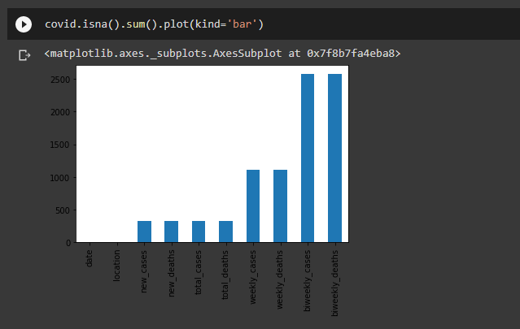

# Python-for-DS
- This repository is created based on the DS  introduction session conducted by DSC VAST

- It contains a data set and a model for the covid patients

- Data set from  https://covid.ourworldindata.org/data/ecdc/full_data.csv

- The link of the Google Collab - https://colab.research.google.com/drive/1zphmk5aLdn13Tj8DI5zf7V3tr2d4cD99?usp=sharing

# Sample output

